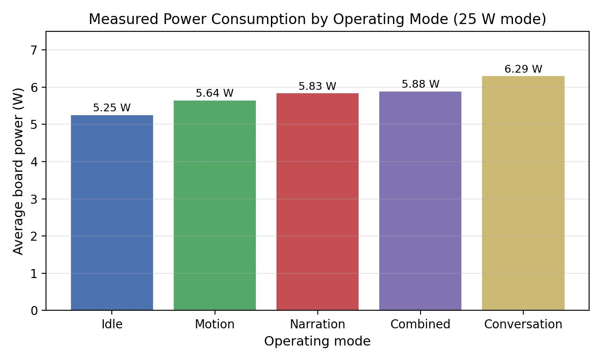

# A-Modular-Edge-AI-Testbed-for-an-Offline-LLM-Enabled-Voice-Interactive-Robot
Fully offline, voice-interactive robot on the NVIDIA Jetson Orin Nano: speech recognition, on-device LLM conversation, and PDF narration in a modular ROS 2 architecture.
<h1 align="center">A Modular Edge-AI Testbed for an Offline<br>LLM-Enabled Voice-Interactive Robot</h1>

<p align="center">
  
  
  
  
  
  
</p>

<p align="center">
A fully <b>offline</b>, voice-interactive mobile robot on the NVIDIA Jetson Orin Nano.
It understands spoken commands, drives its motors, holds a spoken conversation using a
<b>local large language model</b>, and reads PDF storybooks aloud — with <b>no internet required</b>.
</p>

---

## Table of Contents
- [Overview](#overview)
- [Key Features](#key-features)
- [System Architecture](#system-architecture)
- [Hardware](#hardware)
- [Software Stack](#software-stack)
- [Installation](#installation)
- [Build](#build)
- [Usage](#usage)
- [Adding Books](#adding-books)
- [Results](#results)
- [Repository Structure](#repository-structure)
- [Future Work](#future-work)
- [Author](#author)
- [License](#license)

---

## Overview

This project is a modular **edge-AI robotic testbed**. Every stage of the
pipeline — speech recognition, language understanding, narration, and motion
control — runs **locally on the device**, avoiding the connectivity, privacy,
and latency costs of cloud services.

The software is built on **ROS 2 (Humble)** as independent nodes, so each
capability runs on its own and does not slow the others down. A key design
choice is the **brain–muscle split**: the Jetson is the *brain* (speech, LLM,
narration), and a low-cost microcontroller (Arduino) is the *muscle* that
drives the motors with clean, real-time logic.

---

## Key Features

| Feature | Description |
|---|---|
| 🎙️ **Voice movement control** | Spoken commands — *forward, backward, left, right, stop* — drive a differential-drive robot. |
| 💬 **Offline conversation** | Ask a question; the robot answers aloud using a **local LLM** via [Ollama](https://ollama.com/). No cloud, no cost. |
| 📖 **PDF narration** | Say *"read &lt;book&gt;"* and the robot reads a PDF aloud, sentence by sentence. |
| 🔊 **Natural speech** | Neural text-to-speech via [Piper](https://github.com/rhasspy/piper). |
| 🔌 **Fully on-device** | Speech, language, and narration all run offline on the Jetson. |
| 🧩 **Modular ROS 2 design** | Separate nodes for speech, conversation, narration, and motion. |

---

## System Architecture

<p align="center">
  
</p>

```
USB Mic → Speech Node (Vosk, offline STT) → ROS 2 topic /voice_text
                                                  │
                        ┌─────────────────────────┼─────────────────────────┐
                     movement                  question                 "read ..."
                        │                          │                         │
                Conversation Node          Conversation Node          Narration Node
                    → Arduino                → local LLM                → PDF text
                    → L298N                   (Ollama)                     │
                    → DC motors                   └──────── Piper TTS ─────┘
                                                              │
                                                           Speaker
```

**Why an Arduino with the Jetson?** The Jetson's GPIO is 3.3 V and prone to
pin-multiplexing and floating-pin issues, which made direct motor control
unreliable. The Arduino provides clean 5 V logic and dedicated, real-time
motor control, keeping motion steady even when the Jetson is busy running the
LLM. This *co-processor for actuation* is a common, deliberate embedded-robotics
design — not a workaround.

---

## Hardware

| Component | Specification |
|---|---|
| **Compute** | NVIDIA Jetson Orin Nano Developer Kit (8 GB) |
| **OS / Stack** | Ubuntu 22.04 · JetPack 6.2.1 · ROS 2 Humble |
| **Microcontroller** | Arduino (USB serial link to the Jetson) |
| **Motor driver** | L298N H-bridge |
| **Motors** | 2 × DC gear motors (differential drive) |
| **Motor power** | 12 V battery pack (separate from the Jetson) |
| **Audio** | USB microphone + speaker |
---

## Software Stack

| Layer | Tool |
|---|---|
| Speech recognition (STT) | [Vosk](https://alphacephei.com/vosk/) — offline |
| Language model (LLM) | [Ollama](https://ollama.com/) — local, offline |
| Text-to-speech (TTS) | [Piper](https://github.com/rhasspy/piper) — neural, offline |
| PDF text extraction | [PyMuPDF](https://pymupdf.readthedocs.io/) |
| Middleware | ROS 2 Humble |
| Motor firmware | Arduino sketch (serial `F/B/L/R/S`) |

---

## Installation

```bash
# System packages
sudo apt update
sudo apt install -y python3-pip portaudio19-dev flac unzip wget

# Python packages
pip3 install vosk sounddevice pyserial requests pymupdf piper-tts

# Ollama (local LLM runtime)
curl -fsSL https://ollama.com/install.sh | sh
ollama pull llama3.2:3b        # use qwen2.5:7b if memory allows
```

Download the offline models:

```bash
# Vosk speech model
mkdir -p ~/models && cd ~/models
wget https://alphacephei.com/vosk/models/vosk-model-small-en-us-0.15.zip
unzip vosk-model-small-en-us-0.15.zip

# Piper voice
mkdir -p ~/piper_voices && cd ~/piper_voices
wget https://huggingface.co/rhasspy/piper-voices/resolve/main/en/en_US/lessac/medium/en_US-lessac-medium.onnx
wget https://huggingface.co/rhasspy/piper-voices/resolve/main/en/en_US/lessac/medium/en_US-lessac-medium.onnx.json
```

Grant serial-port access for the Arduino (log out and back in afterwards):

```bash
sudo usermod -aG dialout $USER
```

---

## Build

```bash
cd ~/voice_robot_ws
colcon build
source install/setup.bash
```

---

## Usage

Upload the Arduino sketch (in `arduino/`) first — it accepts single letters
over serial: **F**=forward, **B**=back, **L**=left, **R**=right, **S**=stop.

Run the nodes, each in its own terminal:

```bash
# Terminal 1 — the ears
ros2 run voice_robot stt_node

# Terminal 2 — conversation + motors
ros2 run voice_robot conversation_node

# Terminal 3 — PDF narration
ros2 run voice_robot narration_node
```

Then speak:

| You say | The robot does |
|---|---|
| *"move forward"*, *"turn left"*, *"stop"* | Drives the motors |
| *"what is the capital of Pakistan?"* | Answers aloud via the local LLM |
| *"read space"* | Reads `Pdf/space.pdf` aloud |

Test without a microphone by publishing text directly:

```bash
ros2 topic pub --once /voice_text std_msgs/msg/String "{data: 'move forward'}"
```

---

## Adding Books

Drop any PDF into the `Pdf/` folder with a short, simple name
(e.g. `space.pdf`), then say *"read space"*. The robot matches a spoken word
to the file name.

---

## Results

Measured on the Jetson Orin Nano in the **25 W** power mode.

### Latency
| Metric | Mean | Range |
|---|---|---|
| Motion dispatch | ≈ 0.000 s | — |
| Narration dispatch | 0.016 s | 0.006–0.042 s |
| LLM answer (warm) | 1.22 s | 0.29–2.44 s |
| LLM answer (cold start) | 7.54 s | first query only |

### Power (energy characterisation)
| Mode | Power (W) |
|---|---|
| Idle | 5.25 |
| Motion | 5.64 |
| Narration | 5.83 |
| Combined | 5.88 |
| Conversation | 6.29 |

<p align="center">
  
</p>

### Command-Recognition Accuracy
| Command | Quiet | Noisy |
|---|---|---|
| forward | 100 % | 100 % |
| backward | 100 % | 85 % |
| left | 90 % | 75 % |
| right | 100 % | 100 % |
| stop | 100 % | 100 % |
| **Overall** | **98 %** | **92 %** |

<p align="center">
  
</p>

---

## Repository Structure

```
voice_robot_ws/src/
└── voice_robot/
    ├── voice_robot/
    │   ├── stt_node.py            # speech-to-text (Vosk)
    │   ├── conversation_node.py   # LLM chat + motor commands
    │   ├── narration_node.py      # PDF narration
    │   └── __init__.py
    ├── arduino/                   # Arduino motor-control sketch
    ├── Pdf/                       # storybooks to narrate
    ├── images/                    # figures used in this README
    ├── setup.py
    ├── package.xml
    ├── LICENSE
    └── README.md
```

---

## Future Work

Planned extensions, following the project roadmap:

- [x] **Phase 1 — Voice foundation:** offline speech recognition, ROS 2, TTS
- [x] **Phase 2 — Motion:** voice-driven differential drive via Arduino
- [x] **Phase 3 — Conversation:** on-device LLM (Ollama) with natural TTS
- [x] **Phase 4 — PDF narration:** sentence-streamed reading
- [ ] **Phase 5 — Vision:** camera integration with OpenCV / YOLO object detection
- [ ] **Phase 6 — Vision + voice:** answer questions about the scene
      (*"what can you see?"*, *"where is the bottle?"*)
- [ ] **Phase 7 — Autonomy:** LiDAR + SLAM for mapping, navigation, and
      obstacle avoidance
- [ ] **Accent-robust recognition:** a larger or fine-tuned offline acoustic
      model to improve accuracy for accented and short commands

Because actuation is already an independent ROS 2 node, perception and
navigation can be added as new nodes **without re-engineering** the existing
modules.

---

## Author

**Ahmad Ul Hassan**
📧 ahmadulhassan0963@gmail.com

Contributions, issues, and suggestions are welcome — please open an issue.

---

## License

Released under the **MIT License**. See [`LICENSE`](LICENSE) for details.
